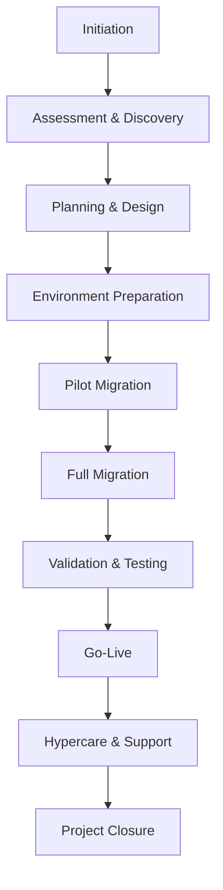

# Migration Lifecycle Diagram

```mermaid
flowchart TD
    A[Initiation]
    B[Assessment & Discovery]
    C[Planning & Design]
    D[Environment Preparation]
    E[Pilot Migration]
    F[Full Migration]
    G[Validation & Testing]
    H[Go-Live]
    I[Hypercare & Support]
    J[Project Closure]

    A --> B
    B --> C
    C --> D
    D --> E
    E --> F
    F --> G
    G --> H
    H --> I
    I --> J
```
