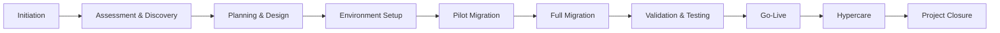
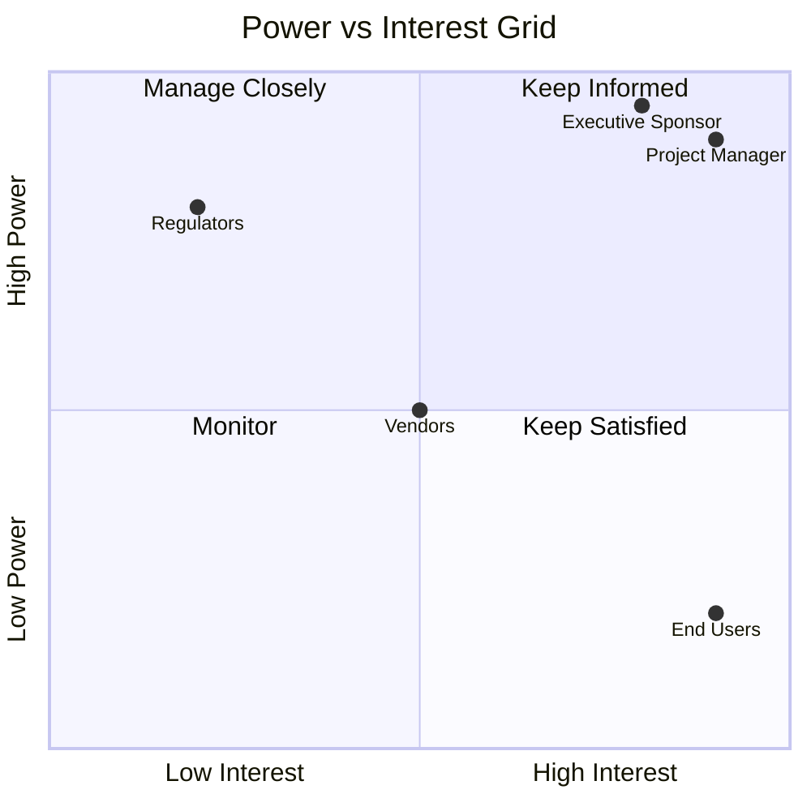

# 🚀 Project Amani

> A migration planning and governance project showcasing stakeholder management, risk management, project scheduling, and executive reporting.

---

## 📋 Project Overview

Project Amani is a structured migration initiative designed to ensure a seamless transition from the current environment to the target solution while minimizing risk, maintaining business continuity, and ensuring stakeholder alignment.

This repository contains the core project management artifacts used throughout the migration lifecycle.

---

## 🎯 Objectives

- Deliver a successful migration with minimal business disruption
- Maintain data integrity and security
- Identify and mitigate project risks
- Track project progress and performance
- Ensure stakeholder engagement and communication

---

## 📂 Repository Contents

### Project Artifacts

| Artifact | Description |
|-----------|------------|
| Migration Lifecycle Diagram | End-to-end migration framework |
| Power-Interest Grid | Stakeholder analysis and engagement strategy |
| RACI Matrix | Roles and responsibilities |
| Risk Heat Map | Risk identification and prioritization |
| Gantt Schedule | Project timeline and milestones |
| Executive Dashboard | Project performance monitoring |

---

## 📁 Repository Structure

```text
Project-Amani/
│
├── README.md
│
├── docs/
│   ├── Migration-Lifecycle.md
│   ├── Stakeholder-Power-Interest-Grid.md
│   ├── RACI-Matrix.md
│   ├── Risk-Heat-Map.md
│   ├── Project-Gantt-Schedule.md
│   └── Executive-Dashboard.md
│
└── images/
```

---

## 🔄 Migration Lifecycle



---

## 👥 Stakeholder Engagement Model



---

## ⚠️ Risk Overview

| Risk | Probability | Impact | Rating |
|--------|------------|---------|---------|
| Data Loss | High | Critical | 🔴 |
| Downtime | Medium | High | 🟠 |
| Scope Creep | High | Medium | 🟠 |
| User Resistance | High | Medium | 🟠 |
| Security Breach | Low | Critical | 🟠 |

---

## 📅 High-Level Schedule

| Phase | Duration |
|---------|----------|
| Discovery | 2 Weeks |
| Planning & Design | 2 Weeks |
| Environment Setup | 2 Weeks |
| Pilot Migration | 1 Week |
| Testing | 2 Weeks |
| Full Migration | 1 Week |
| Go-Live | 1 Week |
| Hypercare | 2 Weeks |

---

## 📊 Executive Dashboard Snapshot

| KPI | Status |
|------|--------|
| Scope | 🟢 |
| Schedule | 🟠 |
| Budget | 🟢 |
| Risks | 🟠 |
| Quality | 🟢 |
| Resources | 🟢 |

---

## ✅ Success Criteria

- Migration completed successfully
- Minimal downtime achieved
- Budget maintained within approved limits
- All critical defects resolved
- User adoption targets achieved

---

## 📚 Documentation

| Document |
|-----------|
| `docs/Migration-Lifecycle.md` |
| `docs/Stakeholder-Power-Interest-Grid.md` |
| `docs/RACI-Matrix.md` |
| `docs/Risk-Heat-Map.md` |
| `docs/Project-Gantt-Schedule.md` |
| `docs/Executive-Dashboard.md` |

---

## 🏁 Project Status

**Current Status:** 🟡 In Progress

**Project Health:** Healthy with active risk monitoring and ongoing stakeholder engagement.

---

### Project Amani
*Delivering successful migration through structured governance and continuous improvement.*
